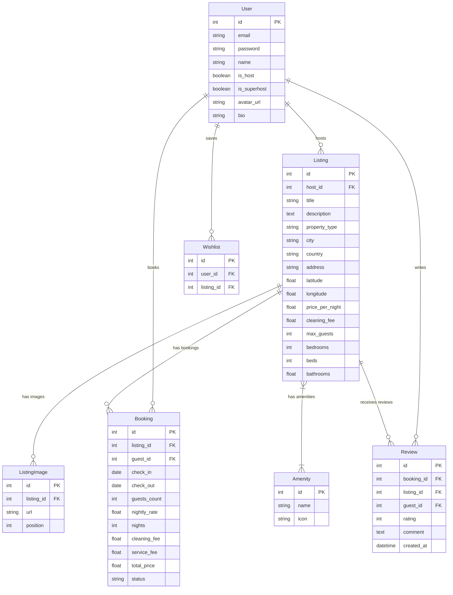

# StayScape — Full-Stack Vacation Rentals & Luxury Stays Platform

A high-fidelity, production-grade vacation rental platform built for the **SDE Fullstack Assignment**. Replicates modern travel marketplace design, user experience, and core browse/search/booking workflows.

---

## 🌐 Live Deployment & Repository Links

- **Live Deployed Application** : (https://stayscape-clone1.onrender.com/)
- **Backend API & Swagger Docs** : **`http://localhost:8000/docs`**

---

##  Assignment Requirements & Compliance Matrix

| Requirement / Section | Feature | Implementation Status | Location |
|---|---|---|---|
| **Core: Home & Search** | Grid of listing cards with photo, title, location, price, rating | ✅ 100% Complete | `frontend/components/ListingGrid.tsx` |
| | Search bar (location + date range + guests) | ✅ 100% Complete | `frontend/components/SearchBar.tsx` |
| | Category / filter row (price range, property type, amenities) | ✅ 100% Complete | `frontend/components/FilterRow.tsx` |
| | Pagination & location pill quick links | ✅ 100% Complete | `frontend/components/ListingGrid.tsx` |
| **Core: Listing Detail** | 5-Photo mosaic gallery + full-screen lightbox modal | ✅ 100% Complete | `frontend/components/Gallery.tsx` |
| | Title, description, location, amenities, host info | ✅ 100% Complete | `frontend/app/listing/[id]/page.tsx` |
| | Interactive availability calendar / date-range picker | ✅ 100% Complete | `frontend/components/DateRangeCalendar.tsx` |
| | Sticky price breakdown widget (rate × nights + fees) | ✅ 100% Complete | `frontend/components/BookingWidget.tsx` |
| | Ratings aggregation & guest reviews section | ✅ 100% Complete | `frontend/components/ReviewsSection.tsx` |
| **Core: Booking Flow** | Date range & guest count selection with overlap validation | ✅ 100% Complete | `backend/app/routers/bookings.py` |
| | Booking summary & mocked checkout modal | ✅ 100% Complete | `frontend/components/CheckoutModal.tsx` |
| | "My Trips" view (Upcoming, Completed, Cancelled stays) | ✅ 100% Complete | `frontend/app/trips/page.tsx` |
| | Booking persistence (blocks booked dates on listing calendar) | ✅ 100% Complete | `backend/app/models.py` |
| **Core: Host Experience**| Host Dashboard (earnings, listings, guest reservations) | ✅ 100% Complete | `frontend/app/host/dashboard/page.tsx` |
| | Create Listing form with amenities & image URLs | ✅ 100% Complete | `frontend/app/host/listings/new/page.tsx` |
| | Edit Listing & Delete Listing with active booking conflict guard | ✅ 100% Complete | `backend/app/routers/listings.py` |
| **Airbnb Experience** | Toast notifications, Wishlist toggles, Empty states, Skeletons | ✅ 100% Complete | `frontend/contexts/ToastContext.tsx` |
| **Bonus Features** | Interactive Leaflet map with listing location pin | ✅ 100% Complete | `frontend/components/MapSection.tsx` |
| | Leave a review after completed stay | ✅ 100% Complete | `frontend/components/ReviewsSection.tsx` |
| | Superhost badges & rating aggregation | ✅ 100% Complete | `backend/app/routers/listings.py` |
| | Footer with Privacy Policy, Terms of Service, and Sitemap modals | ✅ 100% Complete | `frontend/components/Footer.tsx` |
| | Responsive mobile/tablet/desktop design & Same-Origin API proxy | ✅ 100% Complete | `frontend/next.config.ts` |

---

##  Architecture & Technology Stack

- **Backend**: Python 3.13, FastAPI 0.115, SQLAlchemy 2.0 ORM, SQLite database (`airbnb.db`), Pydantic v2 data validation schemas.
- **Frontend**: Next.js 14+ (App Router), TypeScript, Tailwind CSS, Lucide React Icons, Leaflet Maps (`react-leaflet`).
- **Same-Origin Proxy**: Next.js reverse proxy (`/api/:path*` -> `http://127.0.0.1:8000/api/:path*`) eliminating cross-origin CORS issues across all browsers.
- **Authentication**: Base64 Bearer token simulation (`user_id:email`), quick role switchers on `/login` for seamless evaluator testing.

---

##  Database Schema Diagram



---

##  API Overview & Endpoints

| Method | Endpoint | Description | Auth Required |
|---|---|---|---|
| `POST` | `/api/auth/register` | Register a new guest or host user account | No |
| `POST` | `/api/auth/login` | Log in with email & password, returns Bearer token | No |
| `GET` | `/api/auth/me` | Fetch authenticated user profile details | Yes |
| `GET` | `/api/listings/` | List & filter properties (location, dates, guests, price, type, amenities) | Optional |
| `GET` | `/api/listings/{id}` | Get detailed listing info, images, host, reviews, & booked ranges | Optional |
| `POST` | `/api/listings/` | Create a new property listing | Yes (Host) |
| `PUT` | `/api/listings/{id}` | Edit an existing property listing | Yes (Host) |
| `DELETE` | `/api/listings/{id}` | Delete a listing (blocked if active future bookings exist) | Yes (Host) |
| `GET` | `/api/bookings/mine` | List all bookings for current guest user | Yes |
| `POST` | `/api/bookings/` | Create a booking with server-side overlap validation | Yes |
| `POST` | `/api/bookings/{id}/cancel` | Cancel an upcoming booking | Yes |
| `POST` | `/api/reviews/` | Submit a star rating & review for a completed stay | Yes |
| `GET` | `/api/wishlist/mine` | Get user's saved wishlist listings | Yes |
| `POST` | `/api/wishlist/toggle` | Toggle heart save/remove on a listing | Yes |

---

## ⚡ Quick Start Instructions

### 1. Start Backend Server (FastAPI)
```bash
cd backend
pip install -r requirements.txt
python -m app.seed
python -m uvicorn app.main:app --host 0.0.0.0 --port 8000 --reload
```
- **API Base URL**: `http://127.0.0.1:8000/api`
- **Swagger Documentation**: `http://127.0.0.1:8000/docs`

### 2. Start Frontend App (Next.js)
```bash
cd frontend
npm install
npm run dev
```
- **Web Application URL**: `http://localhost:3000`

---

## Demo Account Credentials

Click quick-login buttons on `/login` or sign in manually:

- **Host User**: `host1@demo.com` / `password123` (Sarah Johnson, Superhost)
- **Guest User**: `guest1@demo.com` / `password123` (Alex Thompson, Digital Nomad)
